# Geometry
在电子白板中进行几何图形创作

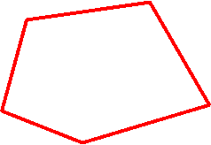
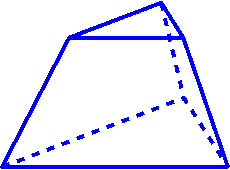
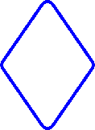

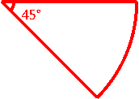
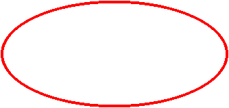
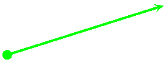

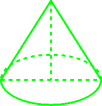
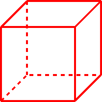
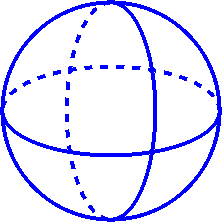

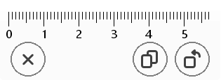
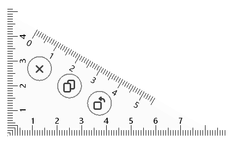
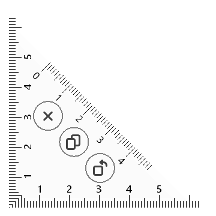
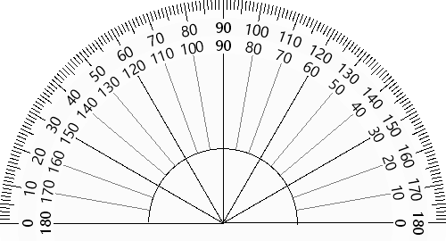

# 特性：
- 一笔画：大部分图形通过鼠标按下、移动、抬起一笔完成
- 可调节：一笔画完，可以进一步拖拽顶点、边进行调节
- 角度标注：自动标注特殊角度（30，45，60，90等）
- 圆角特效：所有二维图形的顶点都可以圆角化
- 角度吸附：一笔画、调节过程中，会自动吸附到特殊角度，方便创建规整的几何图形
- 导出图形：导出为图片（PNG，SVG 等格式），将创作成果在其他地方使用

# 技术方案：
- 基于 C++ 实现几何算法（目前基于 Qt，规划会将核心算法与 Qt 解耦）
- 利用电子白板的功能框架，可实现平移、缩放、选择；拷贝、删除；复制、粘贴等功能
